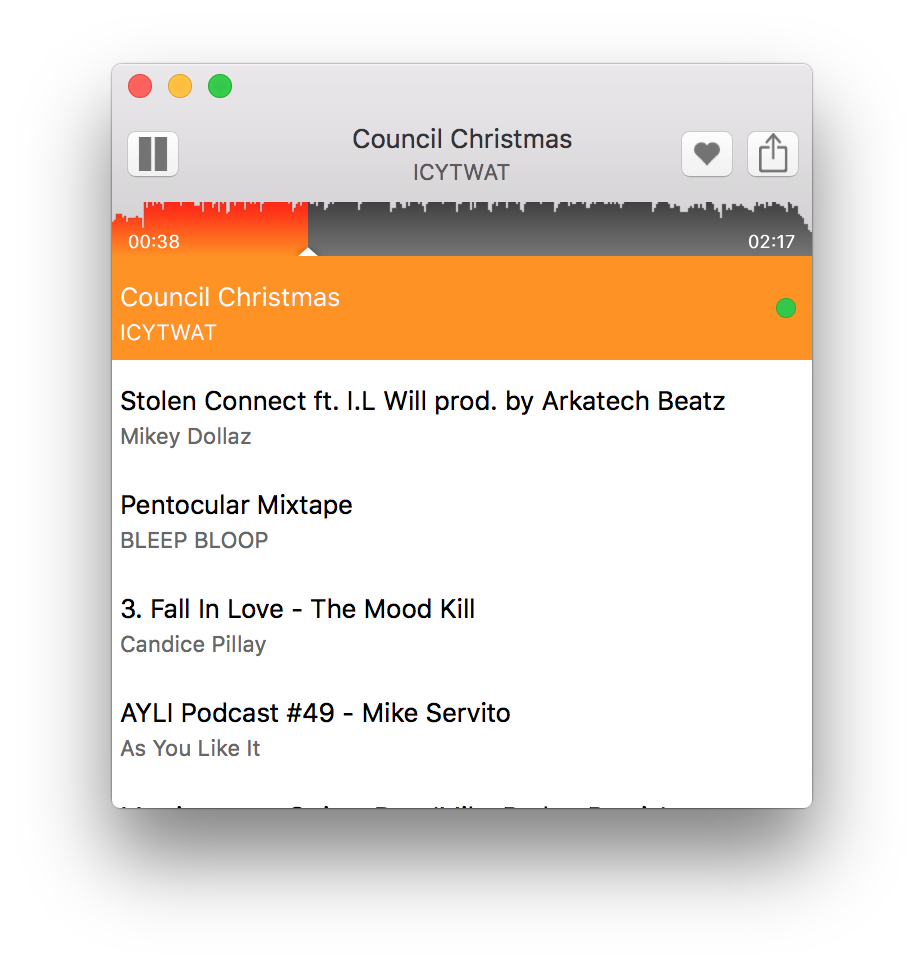

Fresh
=====

Play the latest sounds from your SoundCloud dashboard on your Mac.

## Installation

Until [releases](https://github.com/interstateone/Fresh/releases) are available, you can download and build the source yourself. Fresh has been developed with Xcode 7.2 on OS X 10.11 El Capitan.

## Contributing

If you think you've found a bug in Fresh, don't hesitate to start a conversation about it by opening an [issue](https://github.com/interstateone/Fresh/issues). If you have an idea for something you think would make Fresh even better, you can also open an issue or submit a PR with the changes you'd like to make. Fresh is deliberately small and focused on just playing the tracks on your SoundCloud dashboard, so some changes might not be accepted. But we can chat about it to find out what works best!

## License

MIT License, see the [LICENSE](https://github.com/interstateone/Fresh/blob/master/LICENSE) file for more information. Please don't do anything silly like upload a copy of Fresh to the App Store on your own. :smile:

## Maintainer

Brandon Evans - [@interstateone](https://twitter.com/interstateone)

